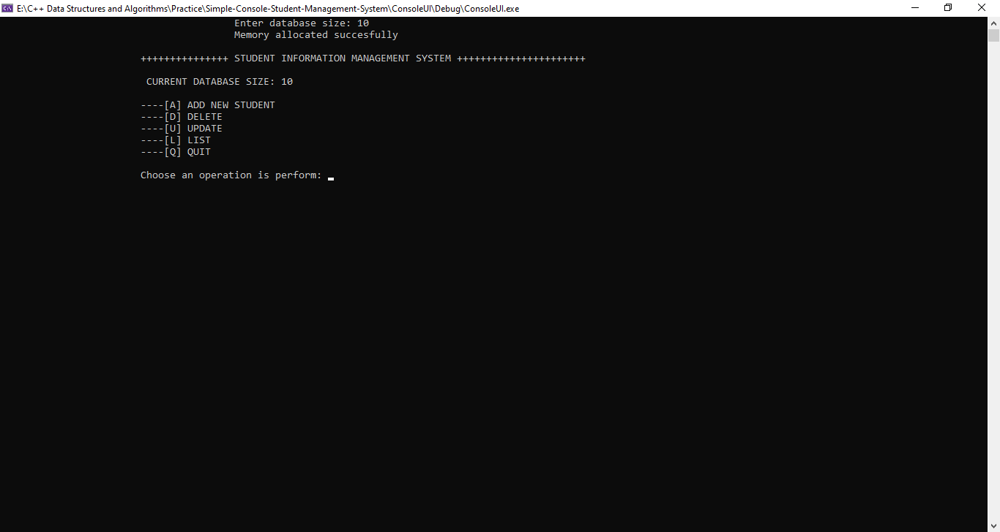
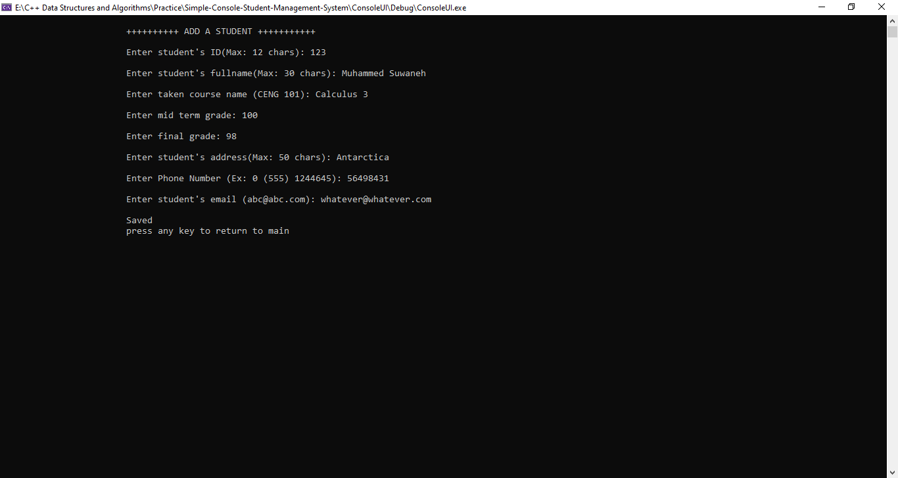
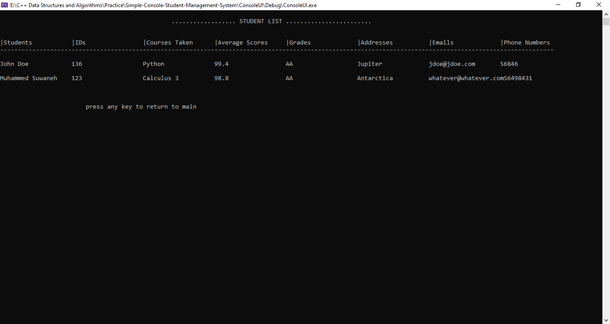
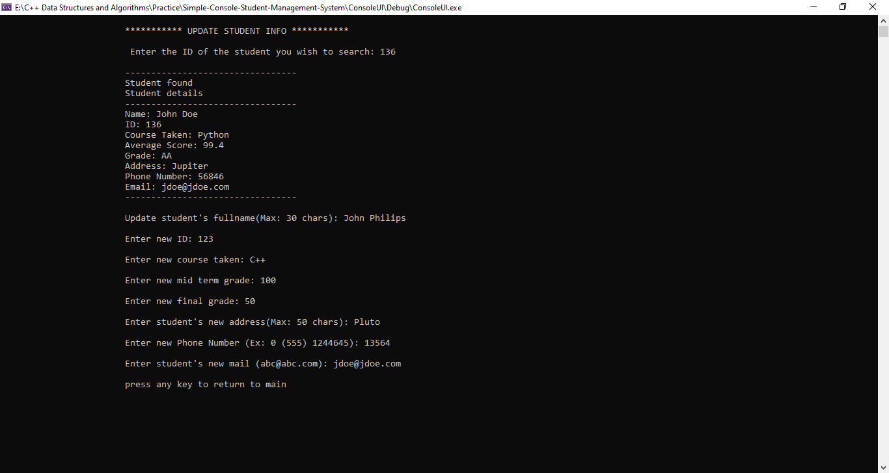
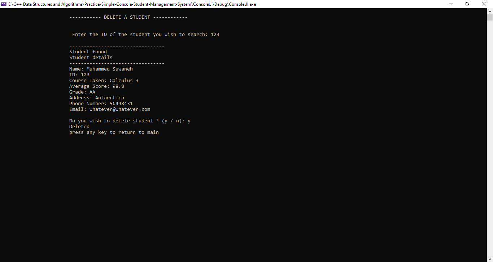

# Simple-Console-Based-Student-Database-System

## Prerequisites 

The project runs on C++ Visual Studio Environment. The program can be run in other IDEs as well.
To do that successfully, only the main.cpp is needed. An enlarged console screen is suitable for correct
visualization.

## About 

The project is an assignment from the Computer Programming 2 Freshman year Course.

The program is a struct-based Student console management system

## Dashboard 

It performs the CRUD operations i.e 

1. Creates a students and stores it in a struct

2. Displays all students

3. Updates a students info

4. Deletes a student

## Technologies 

C/C++, Visual Studio 

## Contributor(s)

Muhammed Suwaneh
